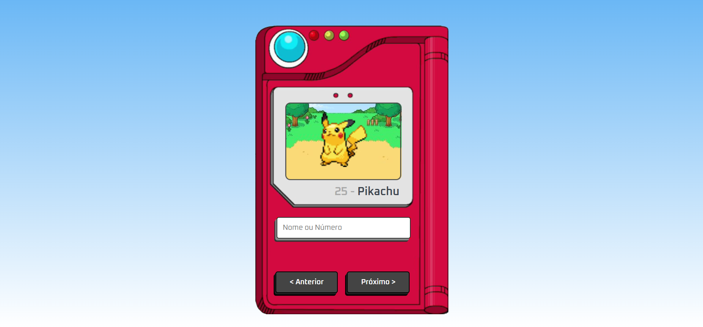

## Apresentação Geral

**Nome do Projeto:** Pokédex

**Descrição:**

Pokedex interativa que permite explorar todos os Pokémon registrados, além de buscar informações 
detalhadas sobre qualquer Pokémon específico usando seu nome ou número de registro.

**Objetivo:**

Consumir a [PokéAPI](https://pokeapi.co) para criar uma Pokédex.

**Tecnologias Utilizadas:**

## Contato

